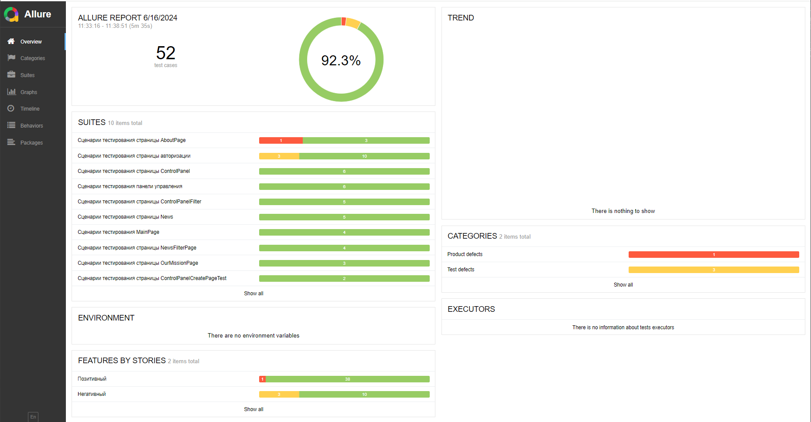

# Отчет о проведенном тестировании мобильного приложения «Мобильный хоспис»

В ходе тестирования было проведено ручное тестирование мобильного приложения (167 тестов), из которых 52 теста были автоматизированы (что составляет 31.14% от общего объема тест-кейсов).

При проведении автоматизированного тестирование 48 тестов были пройдены устешно (92,3%) и 4 теста не пройдены (7,7%)

 
### Список выявленных дефектов при проведении автоматизированного тестирования

1. Поля "Login" и "Password" на странице авторизации принимают значения на кириллице и отображается неверное сообщение об ошибке
2. Поля "Login" и "Password" на странице авторизации принимают значения спецсимволов и отображается неверное сообщение об ошибке
3. Поля "Login" и "Password" на странице авторизации принимают значения длиною свыше 21 символа
4. Не открывается ссылка Privacy Policy на странице About
5. Успешная авторизация при вводе пробела в поля "Login" и "Password" на странице авторизации

## Временной результат сдачи работ
- Время проведения ручного тестировагния - 48 часов
- Время составления плана тестирования, чек-листа, тест-кейсов - 48 часов (на 28 часов больше запланированного)
- Время подготовки автотестирования - 180 часов (на 100 часов больше запланированного)
- Время проведения автотестирования - 7 минут
- Время формирования отчета Allure Report - 5 минут
- Время формирования отчета о проведенном тестировании - 30 минут
- Время формирования баг-репортов - 20 минут

